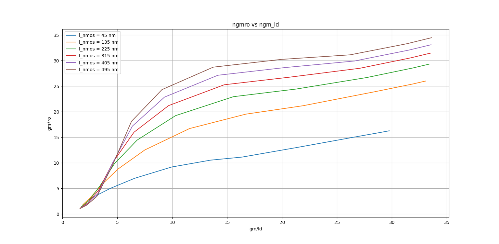
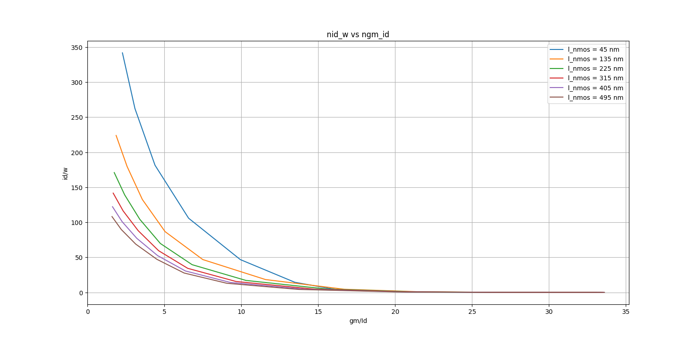
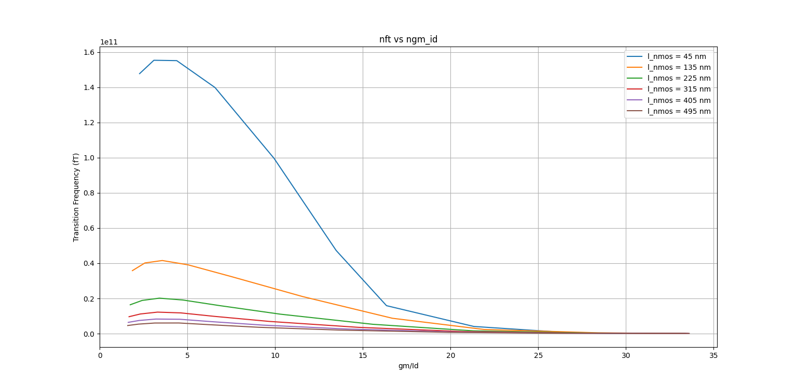
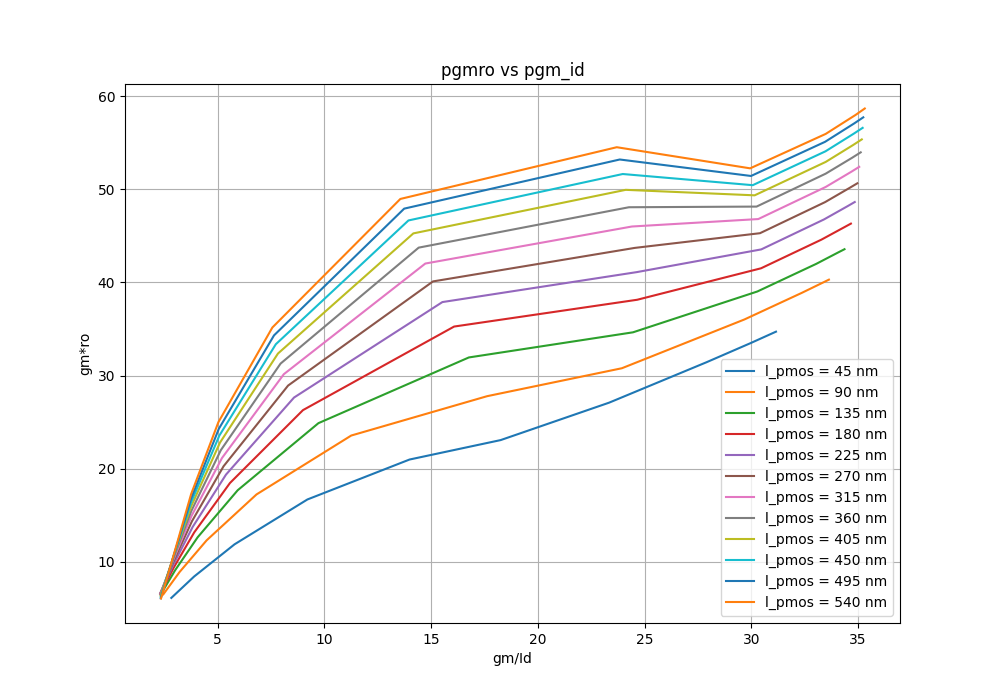
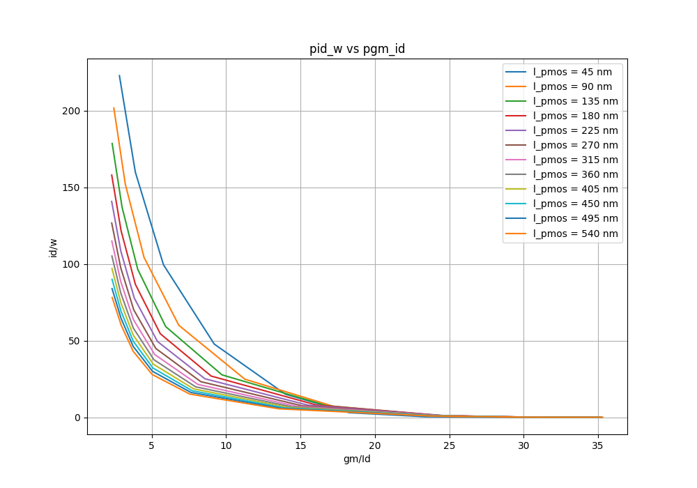
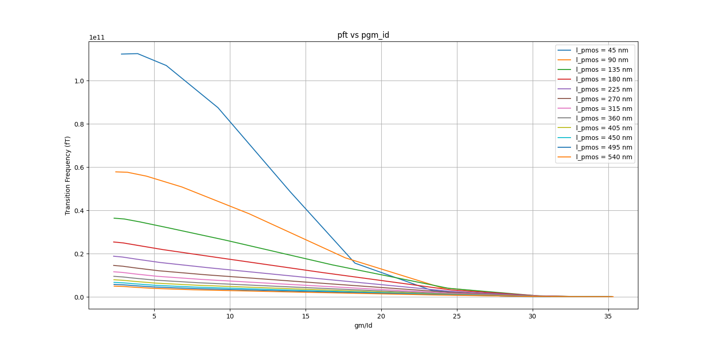

# Tech Plots

Below are the generated technology plots of three different FOMs for the gpdk45 PDK.

## nmos

### ngm_ro vs ngm_id
 

### nid_w vs ngm_id
 

### nft vs ngm_id
 

## pmos

### pgm_ro vs pgm_id
 

### pid_w vs pgm_id
 

### pft vs pgm_id
 