# What is an LDO ? 

A low-dropout regulator (LDO regulator) is a type of a DC linear voltage regulator circuit that can operate even when the supply voltage is very close to the output voltage. 

The main components for an LDO typically consists of a reference voltage, a means of scaling the output voltage and comparing it to the reference, a error amplifier, and a series pass transistor, whose voltage drop is controlled by the amplifier to maintain the output at the required value.

The dropout voltage is the minimum voltage required across the regulator to maintain regulation. The input voltage minus the voltage drop across the pass element equals the output voltage.

When the voltage difference between the input and output falls below the dropout voltage the transistor cannot maintain stable operation and the output voltage decreases.

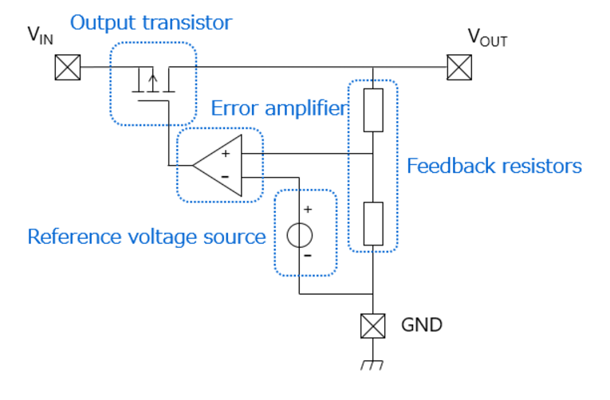<br>

# Externally Compensated LDO Regulator

## Specification of the Design

| Specification                              | Externally Compensated LDO |
|--------------------------------------------|----------------------------|
| Input Voltage (V<sub>in</sub>)             | 1.4 V                      |
| Output Voltage (V<sub>out</sub>)           | 1 V                        |
| Power Supply Rejection Ratio (PSRR) at heavy load | 60 dB                      |
| Minimum Load Current (I<sub>load,min</sub>) | 2 mA                       |
| Maximum Load Current (I<sub>load,max</sub>) | 10 mA                      |
| Load Capacitance (C<sub>load</sub>)        | 1 µF                       |
| Quiescent Current (I<sub>quiescent</sub>)  | 50 µA                     |
| Transient Duration                         | Report                        |


## LTSpice Schematic

<br>

## Calculation of transistor sizes using the gm/Id methodology
### Passfet Sizing:
We sized the pass transistor with the minimum channel length using the 45nm technology node to maximize current flow and minimize resistance. However, to achieve better gain, we opted to use a channel length of 90nm.

gm/Id = 10

Id = 10mA

gm/Id * Id = 100mS

A<sub>passfet</sub> = gmro = 50

Id/w = 38

ro = 500 ohms

CL = 1uF

w = 270um

wp1 = 1/ro*CL = 2Krad/s

fp1 = wp1/(2*pi) = 0.636KHz


### Error Amplifier Sizing:

Loop gain = 60dB = 1000

A<sub>passfet</sub> * A<sub>ota</sub> = 1000

50 * (gmro/2)<sub>ota</sub> = 1000

(gmro)<sub>ota</sub> = 40


#### PMOS LOAD SIZING:

gm/Id = 10

A<sub>pmosload</sub> = gmro = 50

L = 90nm

Id = 25uA

Id/w = 40

w = Id * (w/Id) = 625nm

gm = gm/Id * Id = 250uS 

#### NMOS LOAD SIZING:

gm/Id = 10

A<sub>pmosload</sub> = gmro = 53

L = 90nm

Id = 25uA

Id/w = 90

w = Id * (w/Id) = 280nm

gm = gm/Id * Id = 250uS 

### Current Mirror Sizing:

For current mirror sizing, we use the maximum channel length to achieve high output resistance and minimize channel-length modulation

Maximum length L = 270nm

gm*ro = 155

Id/w = 31

w = Id * w/Id = 2um

PSRR = -58.6dB

## Simulation Outputs

### DC operating points for the MOSFETs

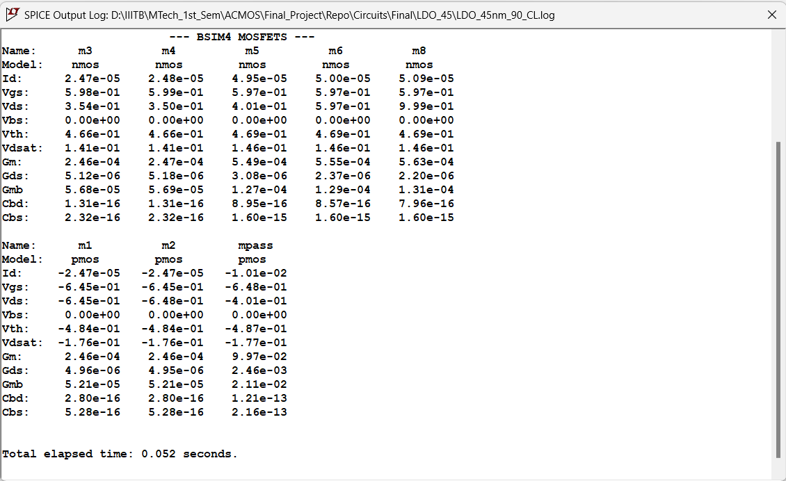<br>

Below table lists down the Vgs, Vth and Vds values and the region of operation for all transistors,

 | Transistor | Vgs / Vsg | Vthn / \|Vthp\| | Vov   | Vds / Vsd | Region of Operation |
|------------|-----------|-----------------|-------|-----------|---------------------|
| M1         | 0.645     | 0.484           | 0.161 | 0.645     | Saturation          |
| M2         | 0.645     | 0.484           | 0.161 | 0.645     | Saturation          |
| M3         | 0.598     | 0.466           | 0.132 | 0.354     | Saturation          |
| M4         | 0.599     | 0.466           | 0.133 | 0.35      | Saturation          |
| M5         | 0.597     | 0.469           | 0.128 | 0.401     | Saturation          |
| M6         | 0.597     | 0.469           | 0.128 | 0.597     | Saturation          |
| MPass      | 0.648     | 0.487           | 0.161 | 0.401     | Saturation          |
| M8         | 0.597     | 0.469           | 0.128 | 0.999     | Saturation          |

### Loop Gain

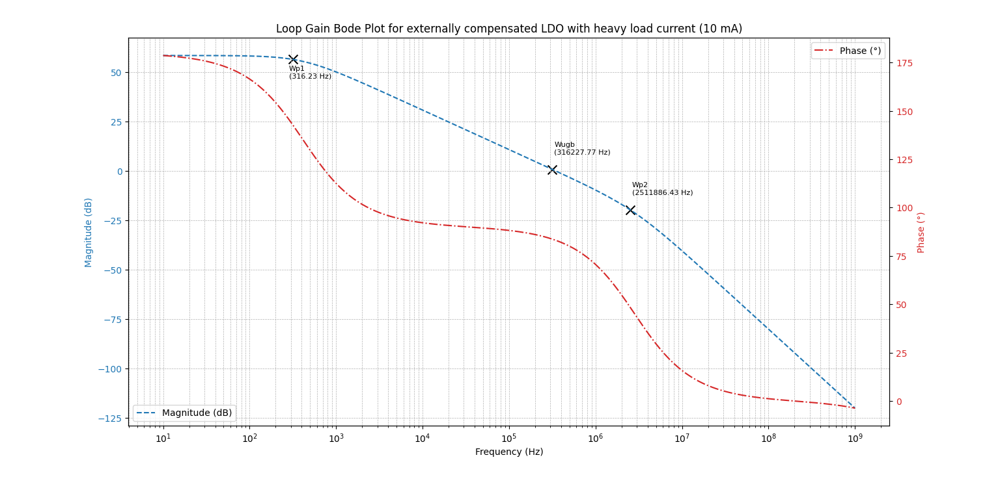<br>

The locations of the two poles and the unity gain frequency is as follows,

| **Pole** | **Frequency** |
|----------|---------------|
| fp1      | 316.23 Hz     |
| f_ugb    | 316.23 KHz    |
| fp2      | 2.51 MHz      |

### Open Loop PSRR

Below is the circuit to simulate the Open-Loop PSSR,

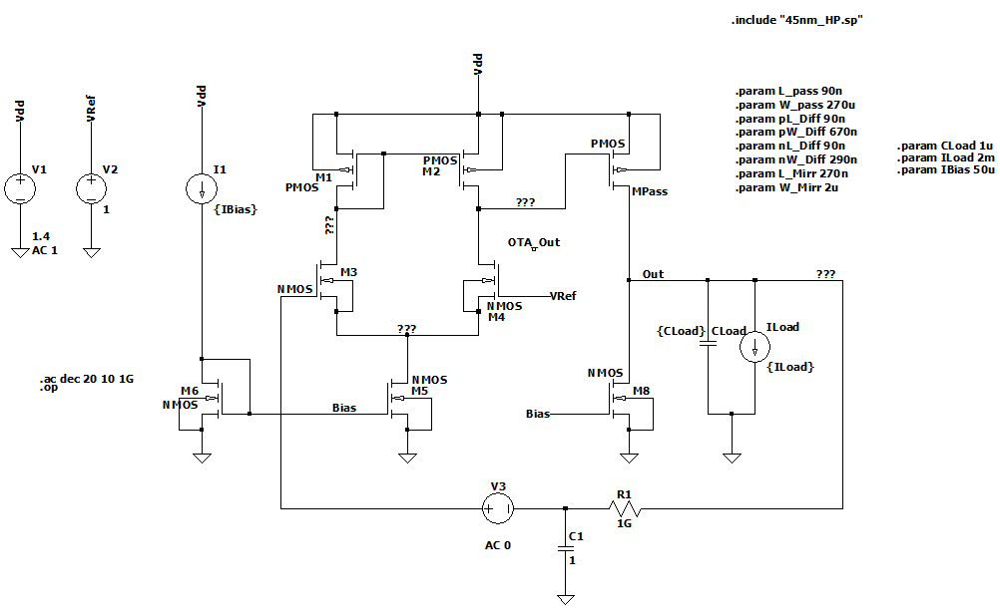<br>

#### Explanation about the simulation aritfacts

In order to calculate the open loop PSRR we need to send an AC signal from the source which in our case is VDD. 

Here we are giving an AC 1 signal in the source. This signal is given to the source of the passfet and the source of pmos in the diffamp. 

We will ideally want very bad PSRR in the diffamp as we want the OTA output to have all the AC noise such that Vsg of pmos = 0 ( small signal analysis ). 

Thus all the noise will get rejected and we will get a noise free dc voltage at the output of the LDO. 

Here in order to calculate the open loop PSRR we have a RC circuit to bias the differential amplifier. 

You can see AC 0 in the circuit indicating that there is an open loop in the circuit . From here we have calculated the open loop PSRR in the circuit. 

Since there is no feedback in the circuit we can thus say that there will be noise at the output and thus the rejection will be very poor.

#### Open Loop PSRR Waveform

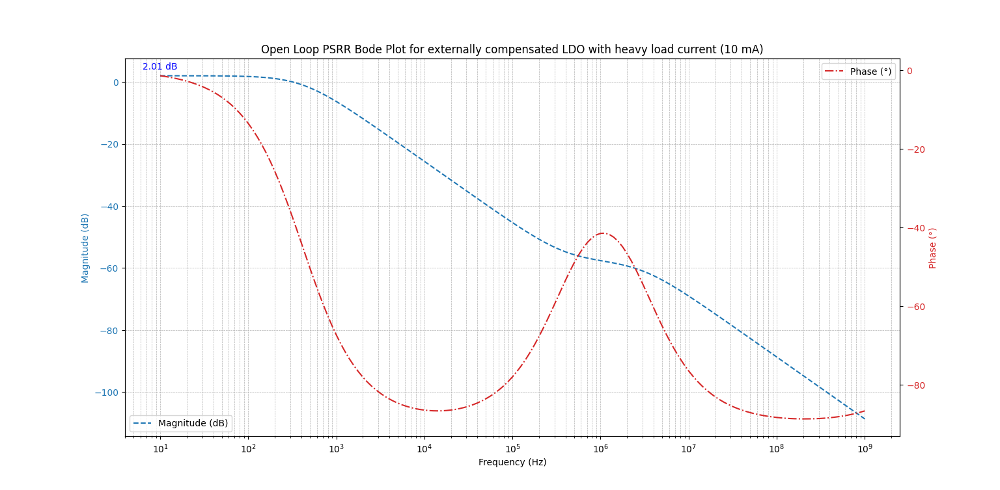<br>

### Closed Loop PSRR

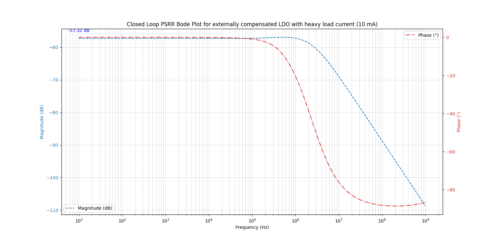<br>

# Internally Compensated LDO Regulator

## Specification of the Design

| Specification                              | Internally Compensated LDO |
|--------------------------------------------|----------------------------|
| Input Voltage (V<sub>in</sub>)             | 1.4 V                      |
| Output Voltage (V<sub>out</sub>)           | 1 V                        |
| Power Supply Rejection Ratio (PSRR) at heavy load | 60 dB                      |
| Minimum Load Current (I<sub>load,min</sub>) | 2 mA                       |
| Maximum Load Current (I<sub>load,max</sub>) | 10 mA                      |
| Load Capacitance (C<sub>load</sub>)        | 2 nF                       |
| Quiescent Current (I<sub>quiescent</sub>)  | 50 µA                      |
| Transient Duration                         | 1 µs                       |


## LTSpice Schematic

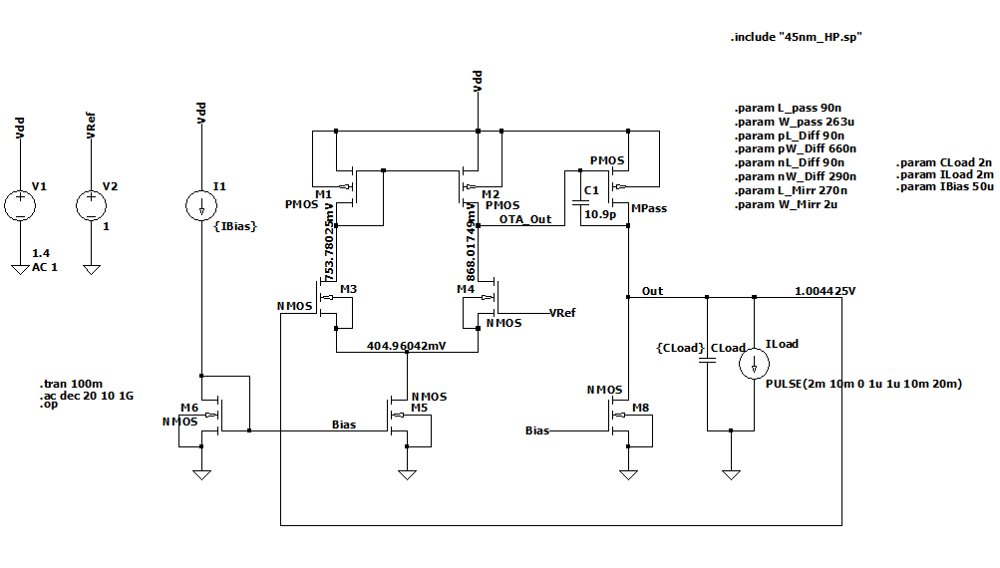<br>

## Calculation of transistor sizes using the gm/Id methodology

We sized the pass transistor with the minimum channel length using the 45nm technology node to maximize current flow and minimize resistance. However, to achieve better gain, we opted to use a channel length of 90nm.


For the calculation,  C<sub>c</sub> we considered a light load condition to account for the worst-case phase margin scenario.

### Pass FET Sizing

```
gm/Id = 10
Id = 10mA
gm/Id * Id = 100mS
A_passfet_heavy = gmro = 50
Id/W = 38 (From Tech Plot)
ro = 500 ohms
W = 270um
```
Size for Pass FET,

```
L = 90 nm
W = 270 um
```

### Error Amplifier Sizing:

```
Loop gain = 60dB = 1000
A_passfet * A_ota = 1000
50 * (gmro/2) = 1000
(gmro)_ota = 40
```


#### PMOS Load Sizing

Size for nmos differential pair transistors in OTA,

```
L = 90 nm
W = 670 nm
```

#### NMOS Load Sizing

Size for pmos load transistors in OTA,

```
L = 90 nm
W = 290 nm
```

### Current Mirror Sizing:

For current mirror sizing, we use the maximum channel length to achieve high output resistance and minimize channel-length modulation

Size for current mirror transistors,

```
L = 270nm
W = 2u
```

For detailed sizing of the other transistors, please refer to this [Excel](Excel/Miller_45nm.xlsx) sheet used for sizing of the transistors.

## Simulation Outputs

### DC operating points for the MOSFETs

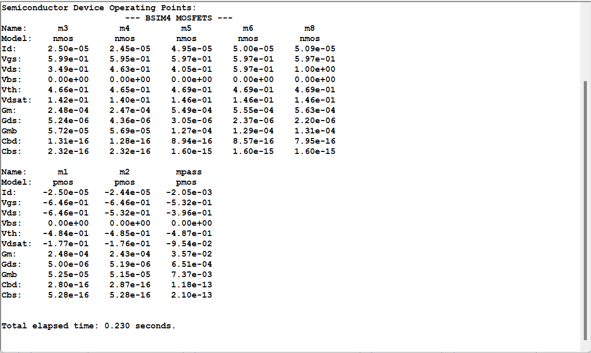<br>

Below table lists down the Vgs, Vth and Vds values and the region of operation for all transistors,

| Transistor | Vgs / Vsg | Vthn / \|Vthp\| | Vov   | Vds / Vsd | Region of Operation |
|------------|-----------|-----------------|-------|-----------|---------------------|
| M1         | 0.646     | 0.484           | 0.162 | 0.646     | Saturation          |
| M2         | 0.646     | 0.485           | 0.161 | 0.532     | Saturation          |
| M3         | 0.599     | 0.466           | 0.133 | 0.349     | Saturation          |
| M4         | 0.595     | 0.465           | 0.13  | 0.463     | Saturation          |
| M5         | 0.597     | 0.469           | 0.128 | 0.405     | Saturation          |
| M6         | 0.597     | 0.469           | 0.128 | 0.597     | Saturation          |
| MPass      | 0.532     | 0.487           | 0.045 | 0.401     | Saturation          |
| M8         | 0.597     | 0.469           | 0.128 | 1         | Saturation          |

### Loop Gain for minimum load current of 2 mA

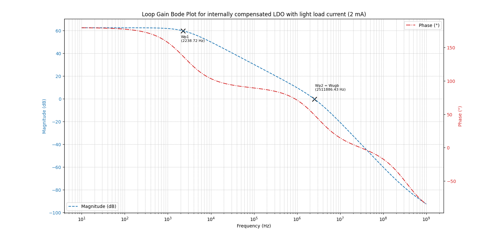<br>

### Open Loop PSRR for minimum load current of 2 mA

<br>

### Closed Loop PSRR for minimum load current of 2 mA

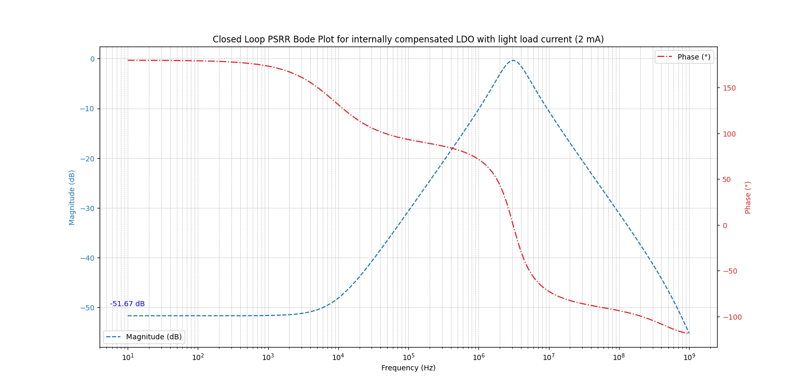<br>

### Phase Margin for 2 mA load current

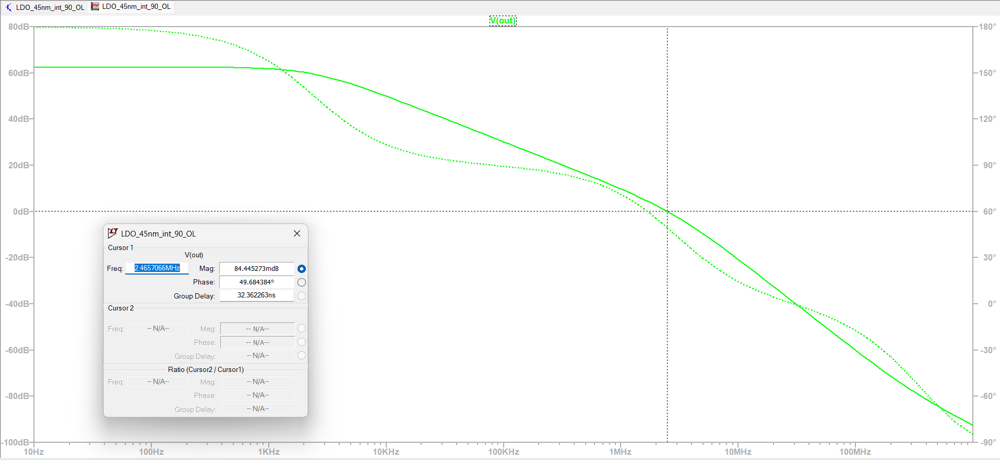<br>


# Tech Plots

## Tech Plots for gpdk045

Below are the generated technology plots of three different FOMs for the gpdk045 PDK.

### nmos

#### ngm_ro vs ngm_id
<br>

#### nid_w vs ngm_id
<br>

#### nft vs ngm_id
<br>

## Tech Plots for ptm_045_hp

Below are the generated technology plots of three different FOMs for the ptm_045_hp PDK.

### pmos

#### pgm_ro vs pgm_id
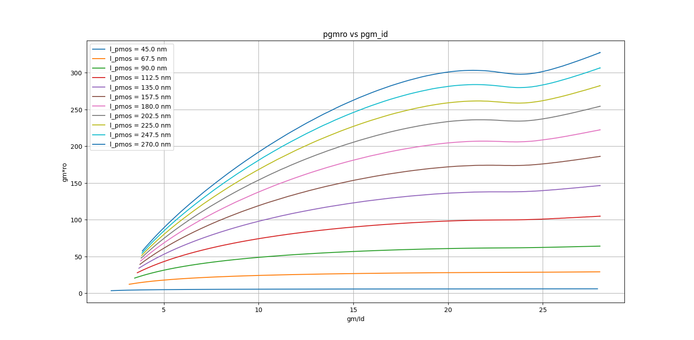<br>

#### pid_w vs pgm_id
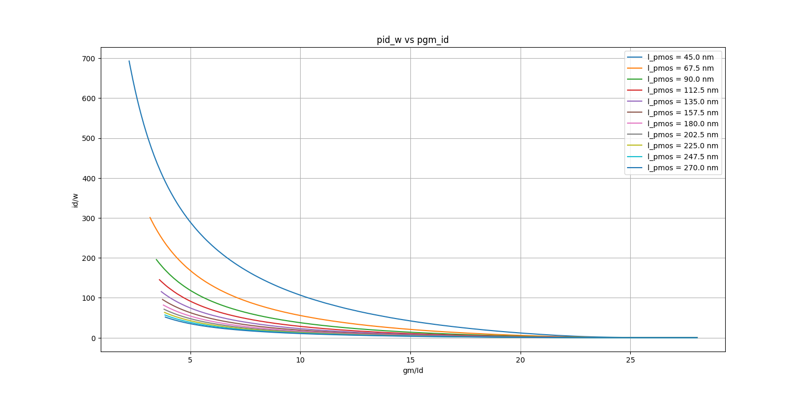<br>

#### pft vs pgm_id
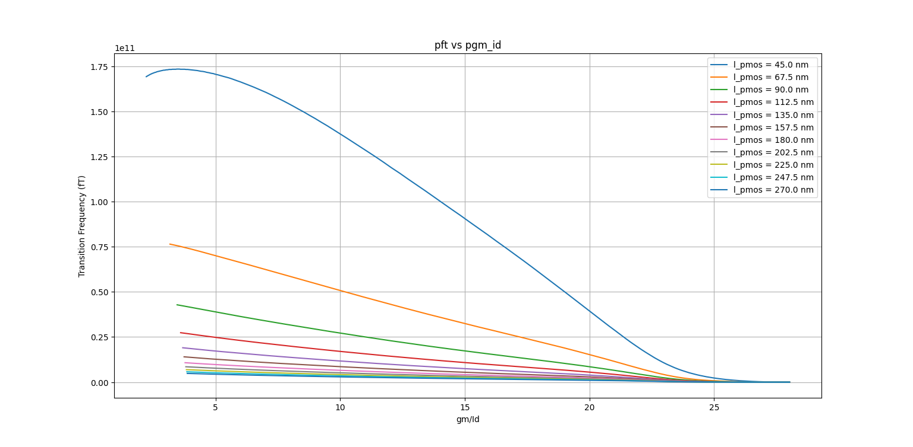<br>

### nmos

#### ngm_ro vs ngm_id
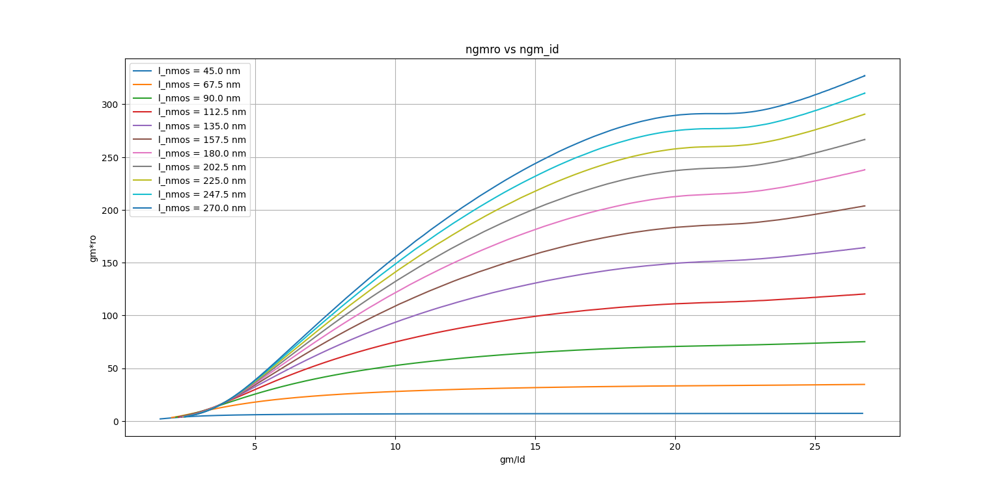<br>

#### nid_w vs ngm_id
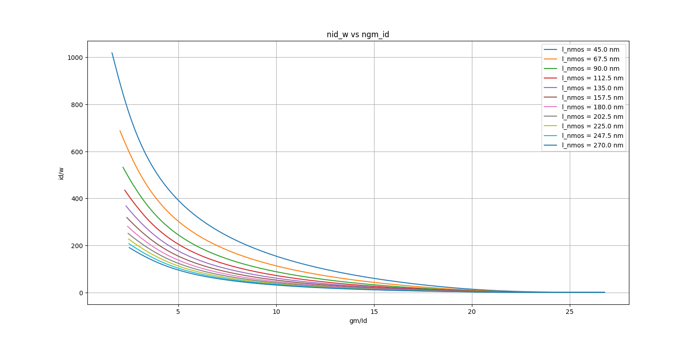<br>

#### nft vs ngm_id
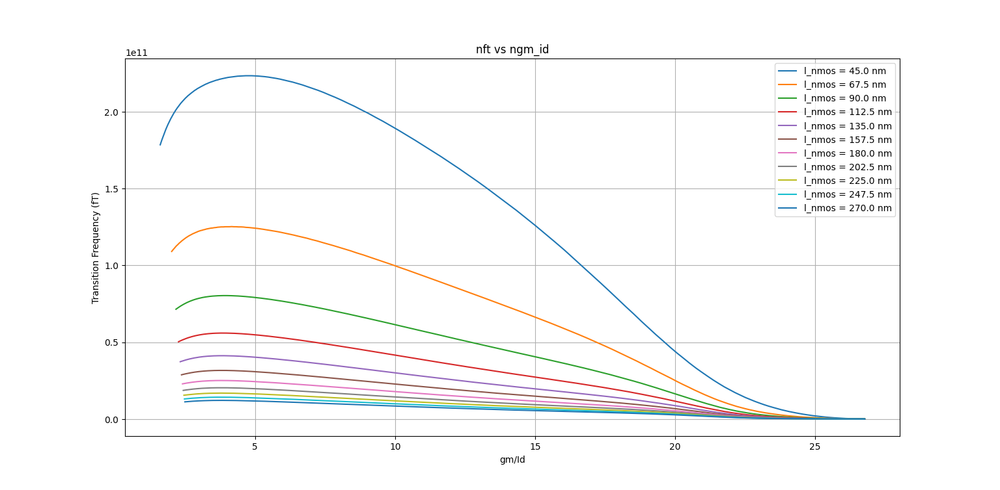<br>